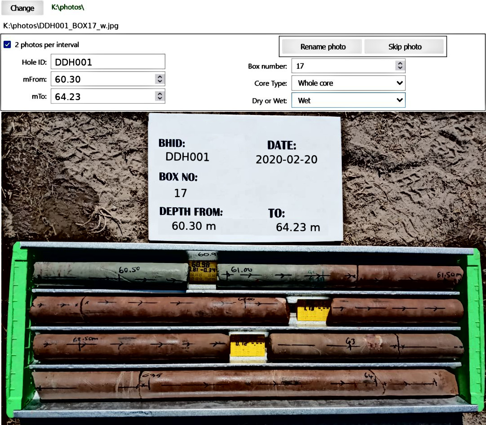

# renameCorePhotos
Rename core photos from mineral exploration drilling

## Desktop app

If running Jupyterlab locally and access to filesystem is granted.

## Usage

- Click change to select photos directory
- First image in that directory is displayed
- If there are wet and dry versions of the core photos, select `2 photos per interval`
- Fill-in `Hole ID`, `Core Type` and `Dry or Wet` boxes
- Use displayed photo to fill in `mFrom`, `mTo` and `Box number` boxes
- Click `Rename photo`
- Then `mFrom`, `Dry or Wet` and `Box number` boxes are updated automatically.
- Update `mTo` and carry on...

Click `Skip photo` to skip photo currently displayed.

Rename of image files is done on the fly, so you can stop anytime.

---
© geoproc.com - 2022
